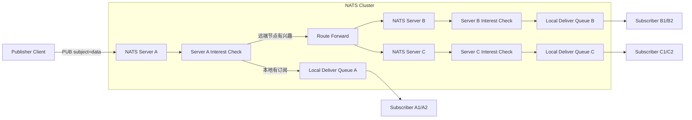
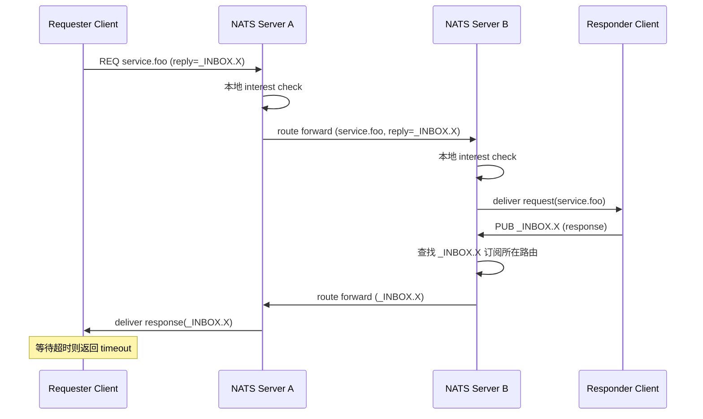

# NATS 集群内部流转图

本文档包含两张图：

1. 发布到订阅（Publish/Subscribe）
2. 请求应答（Request/Reply）

---

## 1) Publish/Subscribe 流转图

简要说明：

- 发布消息先到客户端直连节点（如 A）。
- A 先本地匹配，再按路由兴趣转发到“有该主题订阅兴趣”的节点。
- 远端节点再次做本地匹配并投递给本地订阅者。

---

## 2) Request/Reply 流转图

简要说明：

- Request 本质是“带 reply inbox 的发布”。
- Responder 收到请求后，向 reply inbox 发布响应。
- 集群按 inbox 兴趣把响应路由回最初请求方所在节点，再交付给请求客户端。
- 请求方在超时窗口内未收到响应会返回 timeout。
